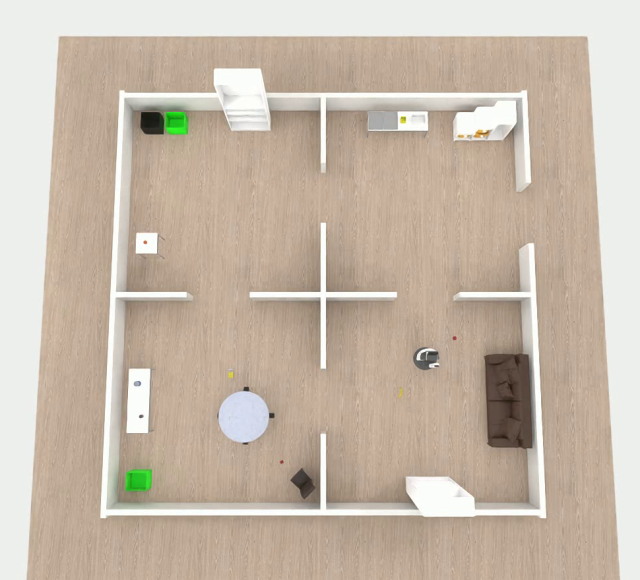

# carrobo — カーロボ@Home 実習用 Isaac Sim 環境



NVIDIA Omniverse / Isaac Sim 上で HSR を扱う `hsr-omniverse` の実習用ブランチ。
4部屋の TidyUp アリーナと、競技の録画機能を追加している。

> **Note:** ROS 2 Humble + Isaac Sim 4.5

---

## クイックスタート

### 動作確認済み環境

| 項目                     | バージョン                  |
| ------------------------ | --------------------------- |
| OS                       | Ubuntu 22.04                |
| GPU                      | NVIDIA RTX 4070 (VRAM 12GB) |
| NVIDIA Driver            | 580.142                     |
| Docker                   | 29.x                        |
| NVIDIA Container Toolkit | latest                      |
| Isaac Sim (コンテナ内)   | 4.5.0                       |
| ROS 2 (コンテナ内)       | Humble                      |

推奨スペック: RTX 30 系以降, VRAM 12GB 以上, RAM 32GB 以上, 空きディスク 100GB 以上。

### 1. Docker と NVIDIA Container Toolkit のインストール

```bash
# Docker
sudo apt update
sudo apt install -y docker.io docker-compose-v2

# ユーザーを docker グループに追加
sudo gpasswd -a $USER docker
# (一度ログアウト・ログインする。または現在のシェルだけなら `newgrp docker`)

# NVIDIA Container Toolkit
curl -fsSL https://nvidia.github.io/libnvidia-container/gpgkey | \
  sudo gpg --dearmor -o /usr/share/keyrings/nvidia-container-toolkit-keyring.gpg
curl -s -L https://nvidia.github.io/libnvidia-container/stable/deb/nvidia-container-toolkit.list | \
  sed 's#deb https://#deb [signed-by=/usr/share/keyrings/nvidia-container-toolkit-keyring.gpg] https://#g' | \
  sudo tee /etc/apt/sources.list.d/nvidia-container-toolkit.list

sudo apt update
sudo apt install -y nvidia-container-toolkit
sudo nvidia-ctk runtime configure --runtime=docker
sudo systemctl restart docker

# コンテナから GPU が見えるか確認
docker run --rm --gpus all nvidia/cuda:12.4.0-base-ubuntu22.04 nvidia-smi
```

### 2. リポジトリのクローン

```bash
git clone --recursive -b carrobo \
  https://github.com/Hibikino-Musashi-Home/hsr-omniverse.git carrobo-isaac
cd carrobo-isaac

# --recursive を忘れた場合は:
git submodule update --init --recursive
```

サブモジュールは `usd/hsrb` (HSR の USD) と `usd/wrs_models` (YCB 物体・家具)。
これらが無いとロボットも物体も出ないので、必ず取得しておくこと。

### 3. キャッシュディレクトリ作成と X11 許可

```bash
# キャッシュディレクトリ (docker-compose でマウントされる)
mkdir -p ~/.carrobo-isaac/cache/{kit,ov,pip,glcache,computecache,data}
mkdir -p ~/.carrobo-isaac/logs

xhost local:
```

### 4. ビルド・起動

操作は `Makefile` 経由で統一している。

```bash
make build          # 全イメージをビルド (初回のみ。30分〜1時間程度)
make up localhost   # シミュレータ一式をlocalhostで起動
make up localhost compe_seed=1    # 競技用の固定Seed 1でlocalhostモードを起動
make up localhost compe_seed=1 TIME=600 # Seed 1＋600秒の競技録画
make tune           # 録画カメラ4台の位置・画角を GUI で見ながら調整する
make tune-apply     # tune の調整結果を configs/placement.yaml に反映する
make down           # 停止・コンテナ削除
make ps             # コンテナの状態
make logs           # 全サービスのログを tail
make exec ros2      # ros2 コンテナで bash (ros2 topic list などを叩く場所)
make exec isaacsim  # isaacsim コンテナで bash

make                # 引数なし → help
```

通常配置は `configs/placement.yaml` を使う。競技のObject Listと共通スポーン位置は
`configs/placement.compe.yaml`、実際に起動する固定配置は
`configs/placement.compe_seed1.yaml` 〜 `placement.compe_seed4.yaml` で管理する。
`compe_seed=1` は `localhost` や `TIME=<秒>` と組み合わせて使用できる。

よく使うオプション:

```bash
make up RVIZ=1                  # RViz2 も起動する (既定はオフ)
make up BASE_DIRECT_DRIVE=0     # 台車を物理車輪駆動に戻す
make up BASE_TRAJ_P_GAIN=1.0    # whole_body の台車追従を弱める
make up DRAWER_DAMPING=5        # 引き出しを軽くする (既定 15)
```

#### 引き出し (Room SW)

Room SW の段違い棚にあるオレンジの箱 (`trofast_1/2/3`) は、起動時に棚との間へ
直動ジョイント (`PrismaticJoint`) が張られ、取っ手を掴んで引ける引き出しになる。
手前方向にだけ 0.30 m スライドし、引ききると止まり、抜け落ちない。

| 変数 | 既定 | 説明 |
| --- | --- | --- |
| `DRAWER_JOINTS` | 1 | 0 で引き出し化をやめ、従来の「棚に置いてあるだけの箱」に戻す |
| `DRAWER_PULL_LIMIT` | 0.30 | 引き出せる距離 [m] |
| `DRAWER_DAMPING` | 15.0 | 引き心地 (粘性抵抗)。重ければ下げる、勢い余るなら上げる |

起動ログに `[drawer] trofast_1 -> prismatic joint (0..0.30 m, damping=15.0)` が
3 行出ていれば設定できている。

Isaac Sim の初回起動は 10〜20 分かかる (シェーダーコンパイル、USD 読み込み)。
2 回目以降はマウントしたキャッシュが効くので速くなる。

### 5. ROS 2 トピックの確認

別ターミナルから:

```bash
make exec ros2
# コンテナ内で:
ros2 topic list
```

`make exec ros2` は `/ros_entrypoint.sh` 経由で bash を起動するので、ROS 環境
(`/opt/ros/humble` と `/ws` の `hsrb_interface` 等) は source 済み。

入れるコンテナは `ros2` と `isaacsim` の 2 つ (`cacheproxy` は裏方なので入らない)。
入り先は省略できないので、必ずどちらかを書く。

#### トラブルシューティング: トピックが `/parameter_events` と `/rosout` しか出ない

`ros2 topic list` の結果がこの 2 つだけになることがある。多くの場合トピックが流れて
いないのではなく、**`ros2` の探索デーモン (今あるトピック/ノードを覚えておく裏方プロセス)
が古い「空」の状態をキャッシュしている**ため。Isaac Sim はロードに時間がかかる
(初回はシェーダーコンパイルで 10〜20 分) ので、Isaac Sim がトピックを出し始める前に
デーモンが起動すると「何も無い」と覚えたまま更新されない。

対処は 1 行。デーモンを止めれば次のコマンドで自動的に作り直され、最新の状態を取得する:

```bash
ros2 daemon stop
ros2 topic list   # 再取得
```

正しく流れていれば `/joint_states` (約 30Hz)・`/scan`・`/head_rgbd_sensor/...` (カメラ)・
`/tf` や、ノード `/isaac_sim_hsr` などが見える。確認用:

```bash
ros2 topic hz /joint_states     # 流量 (Hz) を見る
ros2 topic echo /scan --once    # 中身を 1 件だけ見る
```

> **切り分けのヒント:** isaacsim コンテナ自身と ros2 コンテナの両方から `ros2 topic list`
> を比べると、「コンテナ間通信の問題」か「Isaac Sim 側がまだ出していない」かを判別できる。
> なお Isaac Sim が完全に起動し終えてから確認すれば、最初から正しく見えることがほとんど。

> **ROS_DOMAIN_ID** は既定 26 (実習の学生環境に合わせている)。別 PC と通信するときは
> 両方で必ず揃えること。ずれると一切つながらない。

#### トラブルシューティング: `/head_rgbd_sensor/reconsted/points` が空

トピックは `ros2 topic list` に出るのに `ros2 topic echo` しても何も来ない場合。

この点群は sim 側ではなく `hma2_ws` の `head_pcl_reconst` (`hma_pcl_reconst2`) が作っている。
このノードは `use_compressed: true` で動くため、購読先は raw の画像ではなく**圧縮版**:

- `/head_rgbd_sensor/rgb/image_rect_color/compressed`
- `/head_rgbd_sensor/depth_registered/image_rect_raw/compressedDepth`

Isaac Sim の `ROS2CameraHelper` は raw の `sensor_msgs/Image` しか出さないので、これを圧縮して
配り直す `scripts/rgbd_republisher.py` が必要。`hsr.launch.py` が既定で起動する。
これが動いていないと depth/rgb の同期が一度も発火せず、publisher は advertise だけされて無言になる。

```bash
make exec ros2
# コンテナ内で:
ros2 node list | grep rgbd_republisher                          # 起動しているか
ros2 topic info /head_rgbd_sensor/rgb/image_rect_color/compressed  # Publisher count が 1 か
```

`Publisher count: 0` なら republisher が落ちている。`docker compose ... logs ros2 | grep -i republisher`
でエラーを確認する。意図的に止めたい場合のみ `ros2 launch /hsr.launch.py use_rgbd_republisher:=false`。

なお RViz で表示するときは publisher が BEST_EFFORT なので **Reliability を Best Effort** にすること。
Reliable のままだと QoS 不一致で永久に繋がらない。

#### カメラのレート (既定 30 Hz)

`/head_rgbd_sensor/*` の publish レートは 2 つの間引き設定の積で決まる。

```
カメラ publish [Hz] = 60 / RENDER_EVERY_N_STEPS / (CAMERA_FRAME_SKIP + 1) * RTF
```

| 変数 | 既定 | 意味 |
|---|---|---|
| `RENDER_EVERY_N_STEPS` | 2 | 物理 60 Hz のうち何ステップに 1 回描画するか (= 30 Hz 描画) |
| `CAMERA_FRAME_SKIP` | 0 | 描画したフレームのうち何枚に 1 枚 publish するか (0 = 毎フレーム) |
| `ENABLE_STEREO_CAMERAS` | 0 | head_l/head_r ステレオ (1280x960 x2) を作るか |

既定は `60 / 2 / 1 = 30 Hz` で実機の HSR と同等。物理と whole-body 制御と `/clock` は常に 60 Hz。

以前の既定 (`RENDER_EVERY_N_STEPS=4`, `CAMERA_FRAME_SKIP=2`) は 5 Hz 名目 = 実測 3.9 Hz で、
これがそのまま「`/head_rgbd_sensor/reconsted/points` が 4 Hz しか出ない」原因だった
(中継ノードも `head_pcl_reconst` も律速ではない)。

ステレオ 2 本はレンダープロダクトのピクセル予算の 73% を占めるのに購読者が居ないので、
30 Hz 化の余力を作るため既定で作らない。ステレオ画像が要るタスクのときだけ:

```bash
make up ENABLE_STEREO_CAMERAS=1
```

**RTF が 1.0 を保てないとき** (`ros2 topic hz /clock` が 60 から大きく落ちるとき) は、
軽い順に次を試す。いずれも環境変数なので再ビルドは不要。

```bash
make up CAMERA_FRAME_SKIP=1        # 15 Hz に落とす
make up RENDER_EVERY_N_STEPS=3     # 20 Hz に落とす
```

GUI が要らない運用なら `scripts/launch_isaacsim.py` の `SimulationApp({'headless': False})` を
`True` にすると、カメラとは別に毎フレーム描いている Kit ビューポートの分がまるごと浮く。

#### トラブルシューティング: 点群のレートが発行元より低い

`/head_rgbd_sensor/reconsted/points` は **1 枚 9.83MB** (640x480 x point_step 32) と巨大で、
CycloneDDS の UDP 断片化の影響をまともに受ける。発行元が 30 Hz でも受信側でごっそり落ちることがある。

sim 側 (docker コンテナ) の DDS 設定は `assets/cyclonedds.xml` にあり、`FragmentSize` と
`WhcHigh` をこのサイズ前提で調整済み。

**発行元の `head_pcl_reconst` は `hma2_ws` の Apptainer サンドボックス側で動いており、
DDS 設定も別ファイル** (`hma2_ws/env/rmw_profiles/5e_isaac/cyclonedds.xml`) を読む。
こちらは `FragmentSize` も `WhcHigh` も未指定で Cyclone 既定 (1344B / 100kB) のままなので、
9.83MB が 7300 断片に割られて 1 断片の欠落でサンプルが丸ごと失われる。
このファイルは `hma2_ws/ws_setup/robot/scripts/gen_rmw_profiles.py` の**自動生成物**なので、
直接編集しても再生成で消える。**生成スクリプト側に `FragmentSize`/`WhcHigh` を足す**のが正しい
直し方で、これは hma2_ws リポジトリ側の作業。

---

## 録画の保存先

`make up TIME=<秒>` の競技モードでは、タスク終了時 (指定した時間が来た時) に
4方向カメラの映像を 2x2 に合成した動画が保存される。

```
recordings/<日付_時刻>/arena.mp4      例: recordings/20260729_154230/arena.mp4
```

日付・時刻は起動した時刻。実行のたびに新しいフォルダが作られるので、
過去の録画が上書きされることはない。

録画カメラの位置・画角は `make tune` で GUI を見ながら調整できる
(結果は `recordings/tune/` に出力。`make tune-apply` で `configs/placement.yaml` に反映)。

---

## 開発モード

シミュレータの Python を手で実行したいとき (ログ・エラーをその端末だけに出したいとき):

```bash
make dev up     # コンテナだけバックグラウンド起動 (シミュレータは自動起動しない)
make dev run    # 同じ端末でシミュレータを実行
make dev down   # 停止
```

`dev` を付けると `scripts/` がディレクトリごと live マウントされるので、
編集がコンテナ再起動なしで反映される。

---

## ディレクトリ構成

```
.
├── assets/        # 設定/リソース (cyclonedds.xml, rviz 設定, joint_limits)
├── configs/       # 実行時設定 (placement.yaml, dressing.yaml, textures/) ※下のリンク参照
├── docs/          # README 用の画像
├── env_docker/    # Dockerfile.* と docker-compose.yml
├── examples/      # 制御指示のサンプルコード (実習用。live マウント)
├── launch/        # ROS 2 launch ファイル (hsr.launch.py)
├── recordings/    # 競技モードの録画出力 (git 管理外)
├── scene_dressing/# 部屋の見た目 (テクスチャ・マテリアル) 関連
├── scripts/       # 実行スクリプト (launch_isaacsim.py, hsr.py, arena_cameras.py 他)
├── usd/           # USD アセット (hsrb/ と wrs_models/ はサブモジュール、
│               #   isaac_offline/ は人モデル+モーション。オフライン用に同梱)
└── worlds/        # .world ファイル (家具・壁の配置)
```

エントリポイント: `scripts/launch_isaacsim.py`。Isaac Sim から HSR を起動するメインスクリプト。

設定まわり (world / 物体・ロボットの配置 / 見た目): [configs/README.md](./configs/README.md)
